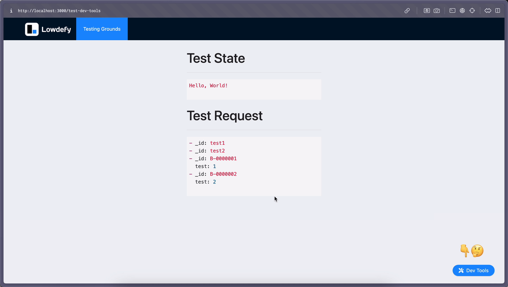

# Lowdefy Dev Tools

1. Clone the `lowdefy-dev-tools` repository alongside your other lowdefy project repositories.
2. Copy the [insert_dev_tools.js](./apps/test-dev-tools/insert_dev_tools.js) file into the same directory as your project's `lowdefy.yaml`.
3. In your `lowdefy.yaml` update your pages config as follows:

    ```yaml
    pages:
      _ref:
        resolver: insert_dev_tools.js
        vars:
          pages:
            - _ref: your-page-1.yaml
            - _ref: your-page-2.yaml
            - _ref: your-page-3.yaml
            ...
    ```

    Alternatively, you can also reference the dev tools in directly with the following code:

    ```yaml
    _ref: ../../../lowdefy-dev-tools/dev-tools/lowdefy_dev_tools.yaml
    ```

    You may need to update the path depending on your project's folder structure.

4. Build and run your lowdefy project as normal, the tools will now be accessible in the bottom right corner:

    

    There is also a [test-dev-tools](./apps/test-dev-tools/) app in this repository you can run and use for testing purposes.

## Under Construction

The [code editor](./dev-tools/view_code_editor/view_code_editor.yaml) is still a work in progress. Once complete it will replace the viewing and editing fields for state and requests. Therefore it is commented out on [lowdefy_dev_tools](./dev-tools/lowdefy_dev_tools.yaml).

Uncomment it and change the properties if you want to see how it behaves currently. If you're using it on a project other than the [test-dev-tools](./apps/test-dev-tools/) app, you will need to add the code editor to your project plugins.
